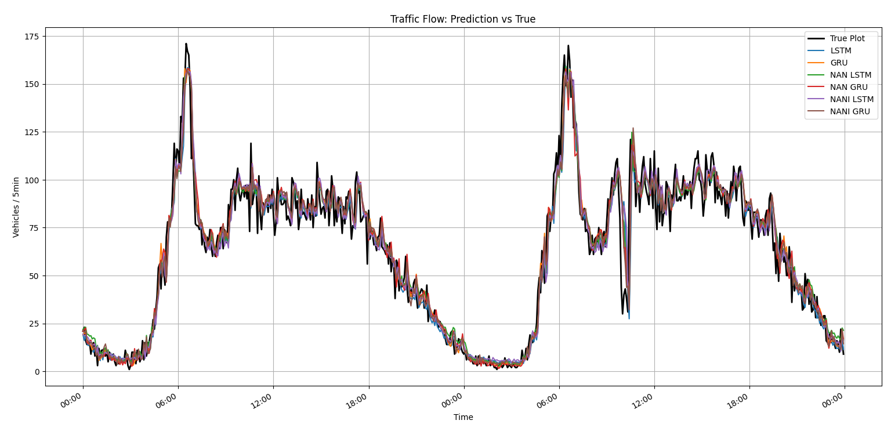

# Traffic_Flow_Optimization
### 🚦 Traffic Flow Prediction using Deep Learning (LSTM, GRU, NAN, NANI)
This project focuses on predicting short-term traffic flow using deep learning models like LSTM, GRU, and their variants enhanced with Noisy Activations (NAN) and Noisy Activations with Noisy Inputs (NANI). The system is built to work with traffic sensor data (5-minute intervals) and offers performance comparisons across all model variants.

# 🚀 Models Implemented
# Model	Description
- LSTM_model	Standard Long Short-Term Memory
- GRU_model	Gated Recurrent Unit
- NAN_LSTM_model	LSTM with Hard Tanh activation
- NAN_GRU_model	GRU with Hard Tanh activation
- NANI_LSTM_model	LSTM with Hard Tanh + Noisy Input
- NANI_GRU_model	GRU with Hard Tanh + Noisy Input

# 📊 Evaluation Metrics (on 5-min interval vehicle flow data)
| Model	| Train MSE |	Train MAE |	Test MSE |	Test MAE |
|-------|-----------|-----------|----------|-----------|
| LSTM_model |	98.6602 |	7.2386 |	103.3291 |	7.4078 |
| GRU_model	| 96.3524	| 7.1779 |	102.2943 |	7.4431 |
| NAN_LSTM_model | 	98.0903	| 7.2958 | 	102.3280 |	7.4691|
| NAN_GRU_model |	100.2429 |	7.3498 |	103.4200 |	7.5041 |
| NANI_LSTM_model	 | 99.8219 |	7.3144 |	105.5591 |	7.5316 |
| NANI_GRU_model |	94.7378 |	7.1303 |	101.1206 |	7.4203 |

✅ NANI_GRU_model performs best overall in terms of both training and testing metrics.

# 📌 Requirements
- Python 3.8+

- TensorFlow / Keras

- NumPy, Pandas, Matplotlib

- scikit-learn

Install using:
```
pip install -r requirements.txt
```
### 📂 How to Use
# 🔧 Training
To train models from scratch (optional):
```
python TrafficFlow.py
```
# 🧪 Testing & Plotting
To evaluate saved models and generate prediction plots:
```
python main.py
```
# 📉 Output
- Evaluation metrics saved to models/evaluation_metrics.csv

- Time-series plot comparing:
    - True vs predicted traffic flows
    - All models (LSTM, GRU, NAN, NANI)

# 📈 Visualization Example

Graph shows actual vehicle count vs predicted values across models.


# 📦 Future Improvements
- Include more diverse traffic datasets (seasonal, weather-based)

- Integrate real-time traffic data APIs

- Expand to multi-step ahead forecasting

- Convert to a web-based dashboard using Flask or Streamlit

